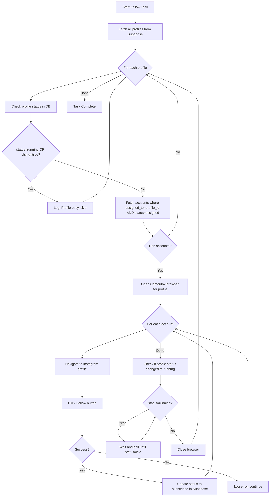

# Auto Follow Logic Implementation

## Overview

The app will automatically loop through all profiles that have assigned Instagram accounts, follow each account, and update the status to `sunscribed` in Supabase after each successful follow.

## Data Flow



## Files to Modify/Create

### 1. Create Instagram Accounts Client - [supabase/instagram_accounts_client.py](supabase/instagram_accounts_client.py) (new)

- `get_accounts_for_profile(profile_id)` - fetch accounts where `assigned_to = profile_id` AND `status = 'assigned'`
- `update_account_status(account_id, status)` - update status after follow
- `get_profiles_with_assigned_accounts()` - get list of profiles (with full data) that have pending accounts
- `is_profile_busy(profile_id)` - check if profile has `status='running'` OR `Using=true`
- `wait_for_profile_idle(profile_id, log, should_stop)` - poll until profile becomes idle (with delay between checks)

### 2. Update Follow Session - [automation/Follow/session.py](automation/Follow/session.py)

- Add callback parameter `on_success(username)` to `follow_usernames()` function
- Call callback after each successful follow so status can be updated immediately

### 3. Update Follow Worker - [gui/workers/follow_worker.py](gui/workers/follow_worker.py)

- Add new `AutoFollowWorker` class that:
  - Fetches all profiles with assigned accounts
  - Loops through each profile
  - For each profile, runs follow session with accounts assigned to it
  - Updates account status to `sunscribed` after each success

### 4. Simplify Follow Tab - [gui/tabs/follow_tab.py](gui/tabs/follow_tab.py)

- **Remove** profile dropdown (no longer needed - all profiles processed automatically)
- **Remove** usernames preview section (fetched per-profile from DB)
- Keep only Start/Stop buttons and log area
- Use `AutoFollowWorker` instead of `FollowWorker`
- Show which profile is currently being processed in the log

## Key Logic

```python
# Pseudo-code for the auto follow flow
profiles_with_accounts = get_profiles_with_assigned_accounts()

for profile in profiles_with_accounts:
    profile_id = profile['profile_id']
    
    # Check if profile is busy (running scrolling)
    if is_profile_busy(profile_id):
        log(f"⏭️ Profile {profile['name']} is busy (scrolling), skipping...")
        continue
    
    accounts = get_accounts_for_profile(profile_id)
    usernames = [acc['user_name'] for acc in accounts]
    account_map = {acc['user_name']: acc['id'] for acc in accounts}
    
    def on_follow_success(username):
        account_id = account_map.get(username)
        if account_id:
            update_account_status(account_id, 'sunscribed')
    
    follow_usernames(
        profile_name=profile['name'],
        proxy_string=profile['proxy'],
        usernames=usernames,
        on_success=on_follow_success
    )
    
    # After following is complete, wait if scrolling started
    wait_for_profile_idle(profile_id, log, should_stop)
    # Browser closes automatically after follow_usernames returns
```