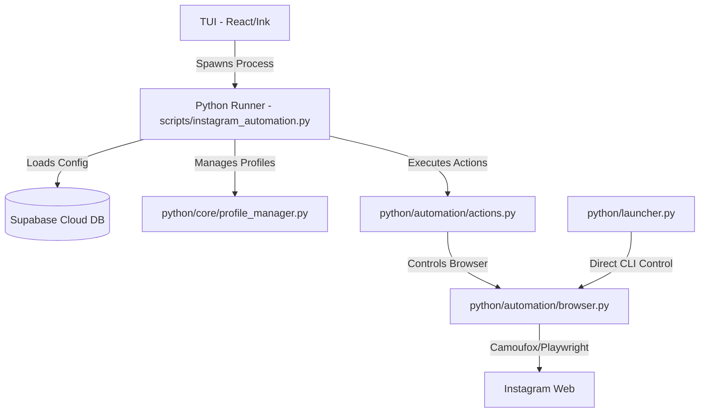

# Antidetect Instagram Automation

A sophisticated Instagram automation tool with antidetect capabilities, built with Python, Camoufox, and React (Ink). This application enables secure management of multiple browser profiles and performs human-like actions on Instagram to minimize detection.

## 1. Project Overview

### Purpose
The Antidetect Instagram Automation tool is designed for users who need to manage multiple Instagram accounts with high levels of anonymity. It leverages advanced fingerprint spoofing and human-like interaction patterns to bypass automated detection systems.

### Key Features
- **Multi-Profile Management**: Create and synchronize browser profiles across local storage and Supabase cloud.
- **Antidetect Capabilities**: Powered by [Camoufox](https://camoufox.com/), featuring hardware fingerprint spoofing, WebGL/Canvas protection, and humanized cursor movements.
- **Human-Like Interactions**: 
    - **Smart Scrolling**: Intelligent feed and reels consumption with configurable interaction chances (likes, follows).
    - **Targeted Following**: "Pre-follow" interactions including watching highlights and liking posts before following.
    - **Story Engagement**: Automatic story watching to simulate real user behavior.
    - **Direct Messaging**: Automated messaging with template support and cooldowns.
    - **Account Maintenance**: Unfollowing and follow request approval logic.
- **Hybrid Interface**: Interactive Terminal User Interface (TUI) for management and a robust CLI for direct task execution.

### System Architecture


## 2. Technical Specifications

### File Structure
- `python/`: Core logic for browser control and Instagram interactions.
    - `automation/`: Action implementations (Follow, Scrolling, Messaging, etc.).
    - `core/`: Application state, TOTP, and Profile Management.
    - `supabase/`: Database clients.
    - `launcher.py`: Direct CLI entry point for single tasks.
- `source/`: Node.js-based Terminal User Interface (React/Ink).
- `scripts/`: Entry point scripts for automation tasks.
- `data/`: Local storage for browser profiles and execution logs (gitignored).
- `dist/`: Compiled TUI code.

### Technology Stack
- **Languages**: Python 3.10+, TypeScript
- **Browser Engine**: Camoufox (based on Playwright/Firefox)
- **Backend/DB**: Supabase (PostgreSQL)
- **UI Framework**: React with [Ink](https://github.com/vadimdemedes/ink) (for TUI)
- **Authentication**: TOTP (Two-Factor Authentication) support

### Environment Requirements
- Python 3.10 or higher
- Node.js 16 or higher (for TUI)
- Active Supabase project
- Proxy support (HTTP/SOCKS5)

## 3. Setup Instructions

### Prerequisites
1. Install [Python](https://www.python.org/).
2. Install [Node.js](https://nodejs.org/).
3. Create a [Supabase](https://supabase.com/) project.

### Installation
1. **Clone the Repository**:
   ```bash
   git clone <repository-url>
   cd anti
   ```

2. **Install Python Dependencies**:
   ```bash
   pip install camoufox supabase python-dotenv requests playwright
   playwright install firefox
   ```

3. **Install TUI Dependencies**:
   ```bash
   npm install
   npm run build
   ```

4. **Environment Configuration**:
   Create a `.env` file in the root directory:
   ```env
   SUPABASE_URL=your_project_url
   SUPABASE_PUBLISHABLE_KEY=your_key
   SUPABASE_SECRET_KEY=your_secret_key
   ```

## 4. Usage Documentation

### Running the TUI Dashboard
The primary way to manage profiles and start automation is through the TUI:
```bash
npm start
```
From here, you can:
- Manage browser profiles.
- Configure automation settings.
- View live logs.
- Launch multi-profile automation cycles.

### Direct CLI Execution
For specific tasks, use `launcher.py` via the python module:
```bash
python -m python.launcher --name "ProfileName" --action "scroll" --duration 15 --match-likes 20
```

**Common Commands**:
- `--name`: Profile name (required).
- `--action`: `scroll`, `reels`, `mixed`, or `manual`.
- `--duration`: Time in minutes.
- `--match-likes`: Chance (0-100) to like posts.
- `--show-cursor`: Debug mode to visualize human-like movements.

## 5. Development Guidelines

### Contribution Process
1. **Feature Branching**: Always create a new branch for features or bugfixes.
2. **Modular Actions**: Add new Instagram interactions within the `automation/` directory.
3. **Model Consistency**: Ensure any new settings are reflected in `core/models.py`.

### Testing Methodology
- **Humanization Verification**: Use the `--show-cursor` flag in `launcher.py` to verify that mouse movements appear natural.
- **Profile Integrity**: Test profile persistence by launching a profile, logging in, and re-opening to ensure sessions are maintained.
- **Supabase Sync**: Verify that changes in the TUI are correctly reflected in the Supabase dashboard.

### Deployment
1. **Database**: Apply migrations found in `supabase/migrations/` to your Supabase instance.
2. **Environment**: Ensure all production environment variables are set in your deployment environment.

---
*Note: This tool is for educational purposes. Use responsibly and in accordance with Instagram's Terms of Service.*
